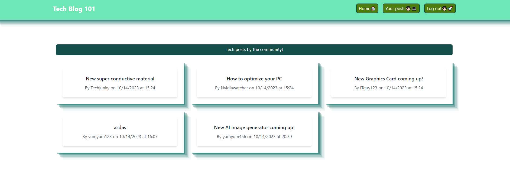
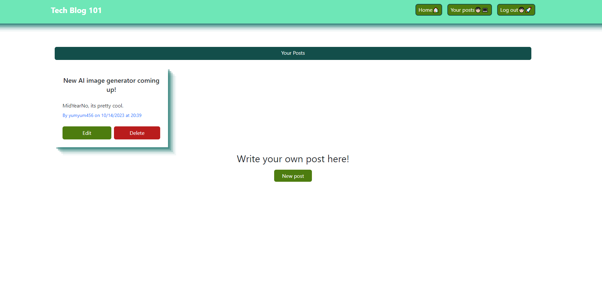

# Challenge-14-MVC

## Overview
This app is a very simple blog webpage, u can check posts and create your own, this way u can keep up to date with the latest tech-related news.

## Features
Check posts made by the community

* Create an account

* Log in/Log out

* Create posts

* Edit posts

* Delete posts

## Installation

* Clone the repository to your local machine.

* Navigate to the project directory.

* Install the required dependencies.
  npm install

* Configure your database connection by creating an environment variable file (.env) in the root directory and specifying the following variables:

DB_NAME=your_database_name
DB_USER=your_mysql_username
DB_PASSWORD=your_mysql_password
DB_HOST=localhost

* Seed the databases
  npm run seed

* Start the server.
  npm start

## Usage
Once the server is running, you can use API testing tools like Insomnia or Postman to interact with the API. The API provides routes for managing categories, products, and tags.

## API Routes

```md
Link to deployed app: 
```
## Preview




## Technologies
This application is built with the following technologies:

* Node.js: JavaScript runtime environment.
* Express.js: Web application framework for Node.js.
* Sequelize: Promise-based Node.js ORM for MySQL.
* MySQL: Relational database management system.
* dotenv: Environment variable management.
* Insomnia: API testing tool for testing API routes.

## Acknowledgments
This application was created as part of my coding bootcamp project.


## Repo
https://github.com/jalpiva98/Challenge-14-MVC